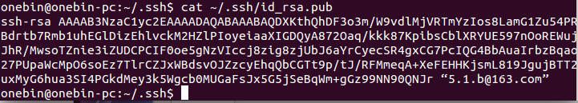
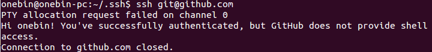

#### 通过SSH通过认证连接


1. 配置git用户名/email

  首先查看git的配置信息：
	```
git config --lis
```
	如果尚未配置用户名和邮箱，则可以通过以下命令进行配置：
	```
git config --global user.name "onebin"
git config --global user.email "5.1.b@163.com"
```

2. 生成SSH密钥
	```
ssh-keygen -t rsa -C “5.1.b@163.com”
```
	这时候会提示你输入密码，建议不填（这样push代码的时候可以不输入密码），不填的话直接3个回车

	生成之后可切换到`cd ~/.ssh`可以看到两个文件`id_rsa`（私钥）和`id_rsa.pub`（公钥）, 接着查看一下公钥的内容：

	```
cat ~/.ssh/id_rsa.pub
```
	输出如下：
	
	把输出部分复制一下，然后在github上添加SSH Key的时候粘贴进去

3. 添加SSH密钥
	```
ssh-add ~/.ssh/id_rsa
```
	添加完密钥之后，配置大致完成，这时候可以简单测试一下：
	```
ssh git@github.com
```
	大致会看到类似的成功提示：
	


